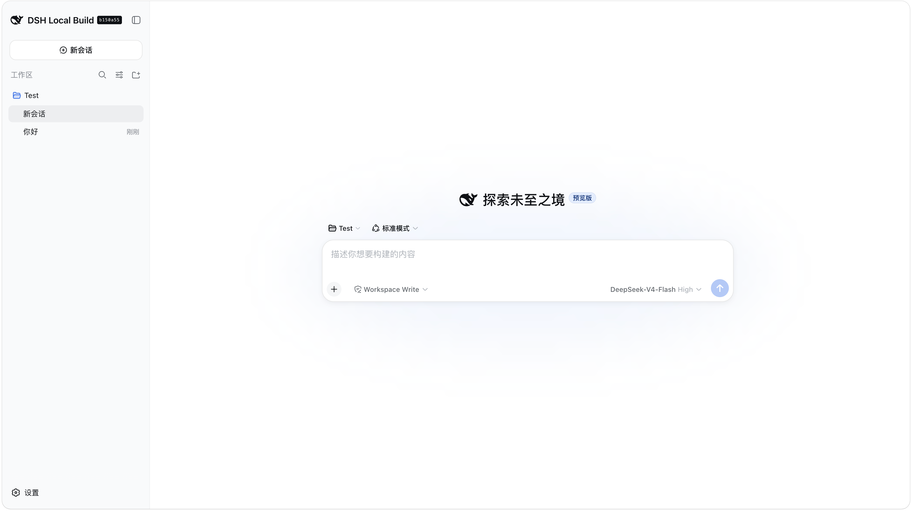

# AIFS

AIFS（AI Functional Selection）是一个面向分子量子化学的智能体原型。当前版本可以通过 DeepSeek Harness 对话界面生成并独立校验 [REST](https://gitee.com/restgroup/rest) 的 TOML 输入卡。

当前版本**只生成和校验输入卡**，不执行 REST 计算，也尚未接入知识图谱或文献 RAG。

## 本地界面



```text
自然语言需求 → DeepSeek Harness → AIFS Tool → FastAPI
                                           ↓
                              REST TOML 输入卡生成与校验
```

## 环境要求

- macOS 或 Linux
- Windows 10/11：通过 WSL2（推荐 Ubuntu）支持；当前不支持原生 PowerShell 启动脚本
- Git
- Conda（Miniconda 或 Anaconda）
- Node.js 22.12 或更高版本（包含 Corepack）

## 安装

建议将 AIFS 和官方 DeepSeek Harness 克隆到同一个目录下：

```text
workspace/
├── AIFS/
└── deepseek-harness/
```

```bash
mkdir aifs-workspace
cd aifs-workspace
git clone https://github.com/SII-chenlz/Ai-DFT.git AIFS
git clone https://github.com/deepseek-ai/deepseek-harness.git deepseek-harness
```

### 1. 创建 Python 环境

```bash
conda create -n aifs python=3.11 -y
conda activate aifs
cd AIFS
python -m pip install -e './backend[dev]'
```

### 2. 安装并构建 DeepSeek Harness

```bash
cd ../deepseek-harness
corepack enable
pnpm install
pnpm run build
```

如果终端提示找不到 `pnpm`，关闭并重新打开终端后再执行 `pnpm --version`。也可以先使用 `corepack pnpm --version` 检查 Node 的 Corepack 是否可用。

### 3. 配置密钥

回到 AIFS 目录：

```bash
cd ../AIFS
cp .env.example .env.local
```

编辑 `.env.local`，只填写这一项：

```bash
DEEPSEEK_API_KEY=你的新密钥
```

`.env.local` 已被 Git 忽略，绝不能提交、截图或粘贴到聊天中。若密钥曾泄露，请在 DeepSeek 控制台撤销并重新生成。

## 启动

确认仍处于 `aifs` Conda 环境后运行：

```bash
conda activate aifs
cd /你的路径/AIFS
./scripts/start-local.sh
```

脚本会自动：

1. 将本地 AIFS 插件挂载到 Harness Web profile；
2. 启动 FastAPI 后端（`http://127.0.0.1:8000`）；
3. 启动 Harness Web（`http://127.0.0.1:3080`）。

浏览器没有自动打开时，访问 `http://127.0.0.1:3080`。使用 `Ctrl+C` 停止服务。

## 常用本地检查

另开一个已激活 `aifs` 环境的终端：

```bash
./scripts/check-local.sh
```

该命令会调用本地后端，生成一张示例 REST TOML 输入卡并进行独立校验。

## 项目结构

```text
backend/             FastAPI：REST 规则、输入卡生成与校验
dsh-plugin-aifs/     TypeScript：DeepSeek Harness Tool 插件
profiles/            可选 Harness profile 配置
scripts/             本地启动与检查脚本
```

## 开发验证

```bash
pytest backend/tests -q
(cd dsh-plugin-aifs && npm test)
(cd dsh-plugin-aifs && npm run typecheck)
```

## 贡献与致谢

- 项目发起与维护：SII-chenlz
- AI 辅助开发：ChatGPT（OpenAI）与 DeepSeek
- 智能体运行框架：DeepSeek Harness
