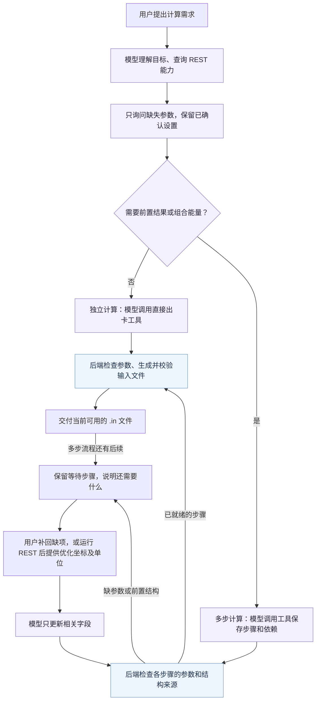

# AIFS

AIFS 是 [DeepSeek Harness（DSH）](https://github.com/deepseek-ai/deepseek-harness) 的 [REST](https://gitee.com/restgroup/rest) 计算助手插件。你说明想算什么，确认结构和方法，它生成并检查 REST `.in` 输入文件。多步计算会保存步骤，补回优化结果后继续出卡。

**目前只准备输入，REST 由用户运行。** 未覆盖全部 REST 功能，范围见 [能力清单](packaging/rest-coverage.md)。仓库包含 TypeScript 插件、Markdown Skill 和 Python 后端。

## 安装

安装包见 [0.1.19 测试版下载页](https://github.com/SII-chenlz/Ai-DFT/releases/tag/v0.1.19)，展开 **Assets**，选择与系统对应的 `.tgz`：[Mac arm64](https://github.com/SII-chenlz/Ai-DFT/releases/download/v0.1.19/aifs-dsh-0.1.19-macos-arm64-local.tgz)／[Windows x64](https://github.com/SII-chenlz/Ai-DFT/releases/download/v0.1.19/aifs-dsh-0.1.19-windows-x64-local.tgz)。全部版本见 [Releases](https://github.com/SII-chenlz/Ai-DFT/releases)。

1. 打开 DSH 桌面版，在「插件 → 添加插件」填写 `.tgz` 安装包的绝对路径，无需解压。
2. 启用 AIFS，打开「AIFS 分子计算助手」状态页，等待显示“可用”。
3. 在 DSH「设置 → 模型」配置接口与 API Key，选择支持工具调用的模型。

0.1.19 为测试版，Mac 与 Windows 原生构建及后端检查通过，真实模型对话和客户端安装尚未完成验收。Intel Mac 暂无安装包。

用户无需安装 Python 或 Node。升级时卸载旧插件、安装新版，完全退出并重开 DSH（Mac 用 `⌘Q`）。

## 使用

例如：

> 我想优化水分子，再计算单点电子能。请推荐适合的方案，让我分别选择优化和单点的泛函、基组，给我当前能用的输入文件。

助手只询问缺少的坐标、单位、电荷、自旋、泛函和基组。优化与单点能可以分别选方法。上述需求先交付优化文件；运行后提供优化坐标及其单位，才交付单点文件。

独立计算直接出卡；想留记录可说“保存这次计算”。多步计划和历史卡保存在 `$DSH_HOME/aifs/`，默认 `~/.dsh/aifs/`。运行 REST 前按计算环境设置基组路径。

导出的文件放在工作区的 `aifs-inputs/`：独立计算各用一个目录，多步计算按计划、任务分目录。后续文件沿用原目录，保留旧版本。

## 三层设计

AIFS 将科学方案、任务管理和 REST 输入规则分开，让新的科研需求复用已有的任务管理机制。

| 层次 | 核心职责 | 扩展时怎么改 |
| --- | --- | --- |
| 科学方案层（AI） | 理解科研目标，提出计算步骤和依赖，推荐并解释方法，与用户确认参数 | 根据实际需求组织方案，避免为每个分子或案例写固定流程 |
| 通用工作流层（AIFS） | 保存任务和参数，管理依赖、等待、失效、版本与恢复，判断哪些步骤可以出卡 | 尽量复用通用规则；增加新的结果类型时补充相应的数据与检查 |
| REST 能力适配层 | 描述 REST 关键字与参数限制，生成并独立校验输入卡 | 随源码核对和实际运行验证，持续补充能力、生成规则与测试 |

DSH 提供模型配置、会话和工具调度；AI 调用 AIFS 工具推进流程；实际计算由 REST 完成。REST 的 README 不完整，因此功能覆盖以已核对、已测试的能力为准。

目前通用工作流主要可靠管理优化坐标的来源与失效；能量、ZPE、波函数等结果的统一管理仍待补齐。长期目标是保持任务管理机制稳定，逐步扩展 REST 能力，让 AI 帮用户理解和组织科学方案。

## 对话与出卡流程

```mermaid
flowchart TD
    A[用户提出计算需求] --> B[模型理解目标、查询 REST 能力]
    B --> C[只询问缺失参数，保留已确认设置]
    C --> D{需要前置结果或组合能量？}
    D -->|否| E[独立计算：模型调用直接出卡工具]
    D -->|是| F[多步计算：模型调用工具保存步骤和依赖]
    E --> G[后端检查参数、生成并校验输入文件]
    F --> I[后端检查各步骤的参数和结构来源]
    I -->|已就绪的步骤| G
    I -->|缺参数或前置结构| J[保留等待步骤，说明还需要什么]
    G --> H[交付当前可用的 .in 文件]
    H -->|多步流程还有后续| J
    J --> K[用户补回缺项，或运行 REST 后提供优化坐标及单位]
    K --> L[模型只更新相关字段]
    L --> I
    classDef model fill:#f3f0ff,stroke:#9382c8,color:#29233c;
    classDef backend fill:#edf5ff,stroke:#7b9dc5,color:#1e3550;
    class B,C,D,E,F,L model;
    class G,I backend;
```

“自动保存”由模型调用工具完成。后端检查出卡参数和优化结构来源；能量、ZPE 等数值仍需人工提供，由模型核对与解释，后端不自动读取或计算。

## 开发与说明

- [产品与开发指南](docs/产品与开发指南.md)：功能、分工、十个工具及改动入口。
- [开发与打包命令](scripts/README.md)。
- [安装与数据迁移](packaging/README.md)。
- [真实对话验收](packaging/local-acceptance.md)。

许可证：[MIT](LICENSE)。
