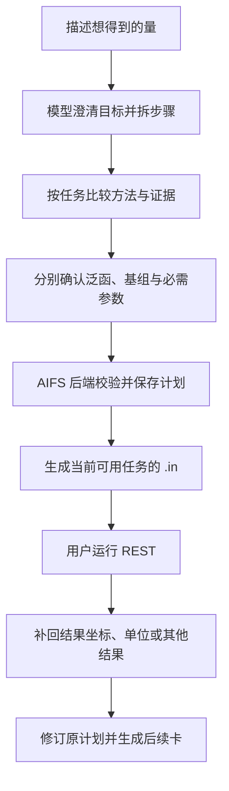

# AIFS 产品与开发指南

## 当前是什么产品

AIFS 是 DeepSeek Harness（DSH）桌面版上的 **REST 计算助手插件**，包含专业 Skill、十个工具和本地 Python 后端。用户选择模型、描述研究目标，助手帮助规划任务、讨论泛函与基组，保存决策，交付逐步 REST `.in` 输入文件。

**当前完成的是计算准备，不是自动计算。** 用户仍在自己的 REST 环境运行文件，补回结果。目标是覆盖 REST 输入准备，目前已有明确缺口，不将“REST 能做”直接表述成“AIFS 全部接入”。

## 已实现的功能

| 功能 | 当前行为 |
| --- | --- |
| 多步计划 | 保存步骤目的、直接依赖、输入来源、缺项、候选方法、决策和状态；支持新会话找回 |
| 方法决策 | 优化、最终单点、频率等可独立选泛函与基组；保留用户选择、支持／相反证据和不确定性 |
| 输入条件检查 | 后端检查依赖无环、结构、单位、电荷、自旋、已确认方法及 REST 参数组合 |
| 逐任务输入卡 | 条件齐全才生成，独立校验后保存原文；可下载、显示正文或由 DSH 文件工具导出 |
| 修订与历史 | 修订保留旧计划，卡片绑定任务及生成时版本；旧卡不能冒充新方案 |
| 本地服务 | 插件自动启动附带后端，随机本机端口；状态页、日志、重试、重载和退出清理 |
| 接口维护 | Python 导出 JSON Schema 和插件结构；漏更新生成文件会让检查与构建失败 |
| 旧数据兼容 | 工作流库升级前备份，事务失败回滚；历史快照按格式版本读取，不擅自补确认参数 |

网页搜索与阅读沿用 DSH，本地证据库是补充，尚未建立全面知识图谱。模型负责科学理解、候选比较和最终表述；Skill 提供指南，程序检查结构化输入。存了引用不证明引用内容正确，卡片通过校验不证明数值精度。

## 从用户需求到输入文件

例如“先优化水分子，再算电子能”：保存优化和单点两步；先交付优化卡，单点等待优化结果。用户补回结果坐标及其单位后，修订计划并交付单点卡。优化和单点的方法可以不同。计算反应能、结合能或脱附能时，需要组成目标量的多个任务；参与同一能量差的最终计算协议应一致。

对比实验要先明确测量的是什么：电子能差、0–0 阈值、有限温度自由能和完整谱图需要的步骤不同。频率／ZPE 按参与物种和化学计量安排，不能固定减去一个 ZPE，也不能把能量差说成完整光谱。AIFS 保存分析公式和要求，当前不解析 REST 结果、不自动求自由文本公式的值。

## REST 覆盖到了哪里

以下是便于理解的摘要。具体电子态、方法及组合条件，以[REST 能力范围](../packaging/rest-coverage.md)和 `get_rest_capabilities` 为准。

| 已接入输入准备 | 主要边界 |
| --- | --- |
| 单点能、优化、力、数值偶极 | 参数完整；已声明方法包括 TPSS 等 meta-GGA、普通杂化、范围分离及 XYG3／XYG7 等双杂化；操作条件需单独查询 |
| Hessian、频率、ZPE／热化学 | 原生和 analdrv 两条路径的支持条件不同；部分开壳层、后 SCF、VV10 组合受限 |
| 电多极矩 | 阶数、参考原点、电子态和密度方法有条件 |
| TDDFT／TDA、稳定性、频域响应、FEAST、PySOC 导出及部分激发态力 | 通道、电子态、求解器与梯度组合有明确限制 |
| 过渡态、IRC、固定原子与优化控制 | 需要适当初始／前序结构；出卡不等于得到正确过渡态 |
| 一维／二维 RRS-PBC 与已声明的附加设置 | RRS-PBC 是有限团簇后处理重构；其他字段按契约检查 |

**尚未完整接入：** MD/AIMD、QM-MM/pure-MM、GW/BSE、analdrv 密度导出、三维 RRS-PBC、复杂激发态优化／梯度、任意 LibXC 或自定义泛函表达式，以及目标计算环境的基组／ECP／外部文件准备。这些任务可记录为待接入步骤，不能生成另一类卡来代替。

当前规则核对到能力清单列出的 REST 源码提交，并非运行时探测所有 REST 发布版本。新增能力需要核对上游解析代码与条件，再接入并测试。

## 谁负责什么

| 部分 | 职责 | 源码入口 |
| --- | --- | --- |
| DSH | 界面、模型与密钥、上下文与会话、选择面板、网页／文件工具、调度 | 外部宿主，AIFS 不修改其源码 |
| 模型 | 理解、规划、科学比较与回复 | 用户在 DSH 配置 |
| Skill 与提示词 | 按目标规划、方法选择、证据与物理量指南 | [Skill](../skills/aifs-molecular-planning/SKILL.md)、`references/`、插件 `src/index.ts` |
| TypeScript 插件 | 注册工具、调用后端、托管进程与状态页 | [插件说明](../dsh-plugin-aifs/README.md)、`src/tools.ts`、`src/client.ts`、`src/desktop/` |
| Python 后端 | API、规则、存储、输入生成与独立校验 | [后端说明](../backend/README.md)、`workflow_models.py`、`workflow_store.py`、`rest/` |
| SQLite | 保存领域记录，独立于安装副本 | 数据目录的工作流库和证据库 |

桌面后端仍通过本机 HTTP 连接，插件自动启动和分配端口。普通用户不用手动启动后端；模型 API Key 只在 DSH 设置。源码编译、Python 冻结后组装成平台 `.tgz`，DSH 安装的是这个包的副本，用户数据另存于 `$DSH_HOME/aifs/`。改源码需要重新构建并升级插件。

## 接手开发：从需求找到改动入口

1. **已有操作的新流程**：先改 Skill 条件指南并加真实结构化计划案例，不必为每种分子新增工具。不要将某个测试体系的方法、电荷或自旋写成通用默认值。
2. **新的 REST 操作或设置**：核对上游，再改 `backend/src/aifs/rest/capabilities.py`／`catalogs.py`、`renderer.py` 和独立 `validator.py`，补支持与拒绝案例，更新能力清单。
3. **新计划字段**：改 Python `workflow_models.py`；重新生成契约。已有快照含义变化时，增加 `workflow_schema.py` 格式适配与旧库测试，不能靠模型猜旧数据。
4. **模型文字或用户交付**：改 `schema-descriptions.ts`、插件提示词或 Skill。DSH 选择面板由 DSH 提供，AIFS 指导模型调用，不重新开发聊天界面。
5. **新工具/API**：保持 Python API 与插件 `tools.ts` 的调用契约一致，并用真实 DSH 服务检查；当前工具名称与 API 路径保持兼容。

Python 是结构契约来源；`contracts/backend-schema.json` 和 `src/generated/backend.ts` 是生成文件，TS 只单独写模型说明。DSH 表达不了的范围、字典值及科学组合继续在后端检查。工作流数据库结构版本、快照格式版本、计划修订号、软件发布版本分别管理。

开发环境使用 Python 3.11 与 Node 22。完整步骤、命令和数据升级说明见[脚本文档](../scripts/README.md#接口与任务维护)。自动检查在 PR、main 推送与手动运行时执行；Windows 打包先通过质量检查，再在 Windows 原生 runner 构建。

## 安装、交付与当前验证范围

安装、模型配置和使用示例见[README](../README.md)，数据搬家见[安装说明](../packaging/README.md)。`.tgz` 可直接添加到 DSH，`.sha256` 是它的完整性摘要。现有平台为 macOS arm64 和 Windows x64，Intel Mac 暂无已验收包。

当前 Mac／Windows 冻结后端及自动检查已通过；Mac 的 DSH 0.2.0-rc.2 桌面服务和 0.2.1-alpha.1 源码服务已完成程序级联调。程序检查覆盖规则、接口同步、历史数据、动态端口、持久化、下载一致性和进程清理；不等同于所有模型的科学回答验收或 REST 数值计算验收。真实对话按[桌面走查](../packaging/local-acceptance.md)核对并记录 DSH 版本；Windows 客户端安装和完整对话仍需单独验收。GitHub 测试产物与已确认的正式发布要区分。

**向别人介绍：** AIFS 把分子计算需求整理成可保存、可追溯的多步 REST 计算计划，帮助讨论方法并准备输入文件。它依托 DSH 的模型和交互能力，当前重点是计算准备与输入可靠性。
